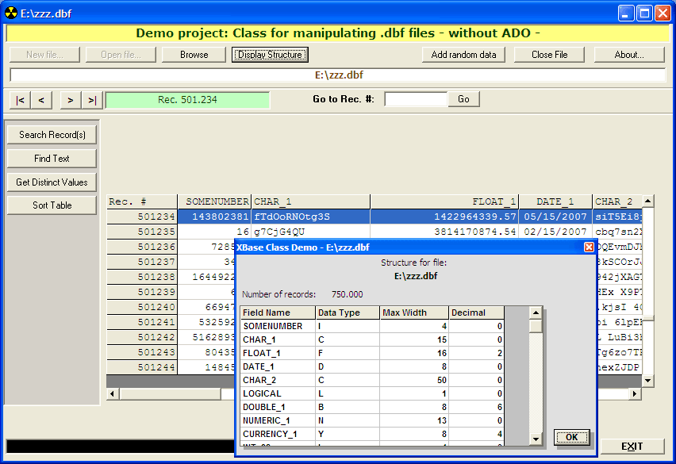



## A Class for accessing dBase or FoxPro dbf file without ADO

### Description

UPDATED. This class is made to access dbf file. This class can read and write to a .DBF file. This class can create a new file, and creating fields as well.

Some additional functions are provided, such as, search record, find text, search distinct value, etc.

Good or bad, please leave your comment and vote. :)
 
### More Info
 
Demo project to show the functions available in this class is included.

This project doesn't require any ADO connection.

Update from previous version:

1. Added function for sorting table

2. Improve search speed

3. New user interface for demo

4. etc. See the file README.TXT for the details

             |
---                |---
**Submitted On**   |2009-07-22 05:32:58
**By**             |[Achmad Junus](https://github.com/Planet-Source-Code/PSCIndex/blob/master/ByAuthor/achmad-junus.md)
**Level**          |Advanced
**User Rating**    |4.9 (59 globes from 12 users)
**Compatibility**  |VB 6\.0
**Category**       |[Databases/ Data Access/ DAO/ ADO](https://github.com/Planet-Source-Code/PSCIndex/blob/master/ByCategory/databases-data-access-dao-ado__1-6.md)
**World**          |[Visual Basic](https://github.com/Planet-Source-Code/PSCIndex/blob/master/ByWorld/visual-basic.md)
**Archive File**   |[A\_Class\_fo2158187222009\.zip](https://github.com/Planet-Source-Code/achmad-junus-a-class-for-accessing-dbase-or-foxpro-dbf-file-without-ado__1-70788/archive/master.zip)

